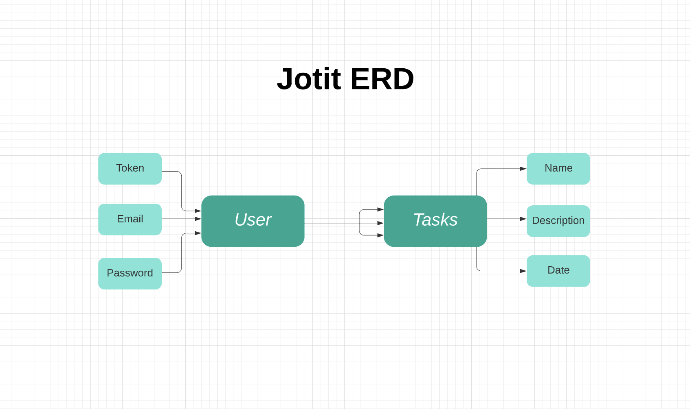

# Application Title: Jotit Task Tracker

Have a task you need to complete? Jotit down! This application allows the user to 1) create an account and 2) sign in to 3) keep track of all one's important tasks, with the ability to create, view, update, cross off, and delete one's own tasks.

## Important Links

- [Deployed Client](https://house-slytherin.github.io/project-frontend/)
- [Deployed API](https://peaceful-dusk-82634.herokuapp.com/)
- [Frontend Repository](https://github.com/house-slytherin/project-frontend)

### Technologies Used

- JavaScript
- jQuery
- HTML/CSS
- Bootstrap
- MongoDB
- Mongoose
- Express
- React

### Planning Strategy

After deciding on an app idea and title, we developed a team scrum plan and created a development planning board. We knew we wanted Jotit to have a simple layout with a side navigation bar and a main area for viewing content. After developing our user stories and drawing up our wireframes and ERD, we started with the backend API and created and tested our user auth (sign-up, sign-in, change password, sign-out) and task (create, show all, show one, update, delete) routes. We then moved to the front end and created and tested corresponding React components for the user auth and task CRUD actions. From there we just needed to style our app and add the ability for an authenticated user to cross off completed tasks.

### Unsolved Problems / Future Updates

- Add the ability for a user to search for a location to add to a task
- Add the ability for a user to record an audio message to add to a task

### API Routes

| Endpoint           | Component        | `AuthenticatedRoute`? |
| ------------------ | ---------------- | --------------------- |
| `/sign-up`         | `SignUp`         | No                    |
| `/sign-in`         | `SignIn`         | No                    |
| `/change-password` | `ChangePassword` | Yes                   |
| `/sign-out`        | `SignOut`        | Yes                   |
| `/`                | `TaskHome`       | Yes                   |
| `/tasks`           | `TasksShow`      | Yes                   |
| `/tasks/:id`       | `TaskShow`       | Yes                   |
| `/tasks-create`    | `TaskCreate`     | Yes                   |
| `/tasks/:id/edit`  | `TaskUpdate`     | Yes                   |
| `/tasks/:id`       | `TaskDelete`     | Yes                   |

### Entity Relationship Diagram

